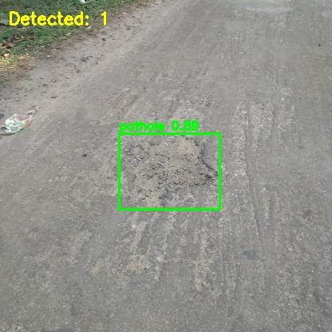
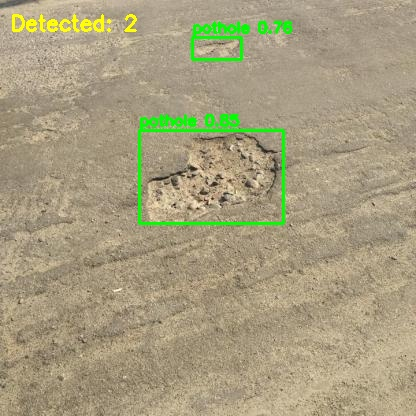
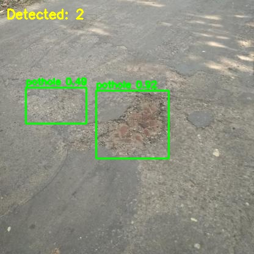
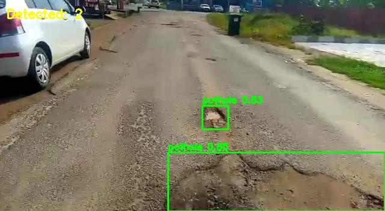
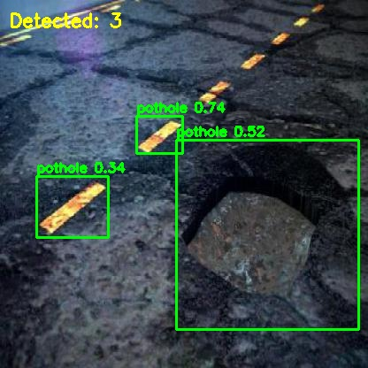
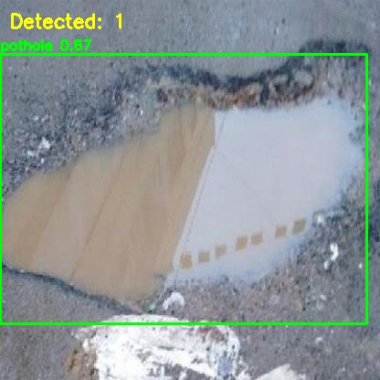

# Pothole Detection using YOLOv8

## 1. Project Overview

This project trains a YOLOv8 (nano) object detection model to detect potholes in road images. The model is trained on
the **Pothole Detection Dataset** from Roboflow and achieves strong performance on validation data.

**Objective:** Given a road image, predict bounding boxes around any potholes present.

---

## 2. Dataset

- **Source:** [Roboflow Pothole Detection Dataset](https://universe.roboflow.com/aegis/pothole-detection-i00zy)
- **Format:** YOLO v5/v8 (converted from OBB for training)
- **Classes:** 1 — `pothole`
- **Annotations:** `class_id x_center y_center width height` (normalized 0-1)

### Dataset Statistics

| Split    | Images | Labels | Notes                          |
|----------|--------|--------|--------------------------------|
| Train    | 1035   | 1035   | 94 images with no potholes     |
| Valid    | 273    | 273    | 27 images with no potholes     |
| Test     | 174    | —      | Reserved for final evaluation   |
| **Total**| 1482   | 1308   |                                |

### Pothole Distribution (Training Set)

- 9.1% of training images have **0 potholes** (negative samples)
- Average potholes per image: **3.32**
- Maximum potholes in a single image: **18**
- Most common count: **1 pothole per image** (24.6%)

=========================================
POTHOLES PER IMAGE DISTRIBUTION (Training Set)
=========================================
- 0 pothole(s):   94 images (  9.1%) 
- 1 pothole(s):  255 images ( 24.6%) 
- 2 pothole(s):  170 images ( 16.4%) 
- 3 pothole(s):  150 images ( 14.5%) 
- 4 pothole(s):   82 images (  7.9%) 
- 5 pothole(s):  100 images (  9.7%) 
- 6 pothole(s):   47 images (  4.5%) 
- 7 pothole(s):   24 images (  2.3%) 
- 8 pothole(s):   20 images (  1.9%) 
- 9 pothole(s):   37 images (  3.6%) 
- 10 pothole(s):   24 images (  2.3%) 
- 11 pothole(s):   21 images (  2.0%) 
- 12 pothole(s):    4 images (  0.4%) 
- 13 pothole(s):    3 images (  0.3%) 
- 14 pothole(s):    1 images (  0.1%) 
- 16 pothole(s):    1 images (  0.1%) 
- 17 pothole(s):    1 images (  0.1%) 
- 18 pothole(s):    1 images (  0.1%) 
---
- Total images:       1035
- Min potholes/image: 0
- Max potholes/image: 18
- Avg potholes/image: 3.32
- Total potholes:     3439

---

## 3. Step-by-Step Workflow

### Phase 1: Data Understanding
- Downloaded dataset from Roboflow (YOLOv8 OBB format)
- Explored dataset structure: 1035 train, 273 validation images
- Analyzed label format: OBB format (9 values per box — rotated coordinates)
- Visualized sample images with bounding boxes
- Analyzed pothole count distribution per image

 


### Phase 2: Data Preparation
- Converted OBB labels (9 values) to standard bounding boxes (5 values: class x_center y_center width height)
- Created `data.yaml` configuration file for YOLO
- Verified image-label pairing across train and validation splits
- Created train/validation split (79.1% / 20.9%)

### Phase 3: Model Training
- Used YOLOv8 nano (`yolov8n.pt`) — pretrained on COCO
- Fine-tuned on pothole dataset for 50 epochs
- Early stopping with patience=10
- AMP (Automatic Mixed Precision) enabled for faster training
- Final model: 3.0M parameters, 8.1 GFLOPs


### Phase 4: Evaluation
- Validated on 273 images
- Achieved mAP50 of 0.899, mAP50-95 of 0.578


### Phase 5: Failure Analysis
- Most "failures" are over-detections (detecting more potholes than annotated)
- False positives often occur on road texture patterns
- Under-detection cases typically involve small or partially visible potholes


---

## 4. Data Exploration & Visualization

### Sample Training Images with Bounding Boxes

The dataset contains diverse road images with varying:
- Lighting conditions (bright sunlight, shade, low light)
- Road textures (asphalt, concrete)
- Pothole sizes (small cracks to large craters)
- Multiple potholes per image (up to 18)

### Sample Predictions

Below are sample predictions from the validation set:

 |  | 
 |  | 

---

## 5. Model Details

### Architecture

| Property          | Value                                      |
|-------------------|--------------------------------------------|
| Model             | YOLOv8n (nano)                            |
| Task              | Object Detection                           |
| Pretrained on     | COCO (80 classes)                          |
| Fine-tuned on     | Pothole dataset (1 class)                 |
| Parameters        | 3,005,843                                 |
| FLOPs             | 8.1 GFLOPs                                |
| Input image size  | 640 x 640                                 |
| Output            | Bounding boxes + confidence scores         |

### Training Hyperparameters

| Hyperparameter       | Value      | Justification                          |
|----------------------|------------|----------------------------------------|
| Epochs               | 50         | Good balance of training time/accuracy |
| Batch size           | 8          | Fits RTX 4050 (6GB VRAM)              |
| Image size           | 640        | Standard; good for small objects       |
| Optimizer            | AdamW      | auto-selected by ultralytics          |
| Learning rate        | 0.002      | auto-selected by ultralytics           |
| Momentum             | 0.9        | auto-selected by ultralytics          |
| Weight decay         | 0.0005     | Standard regularization               |
| AMP (mixed precision)| True       | Faster training with no accuracy loss |
| Early stopping       | patience=10| Prevent overfitting                   |

---

### 6. Training Pipeline

```python
from ultralytics import YOLO

model = YOLO('yolov8n.pt')

results = model.train(
    data='data.yaml',
    task='detect',
    epochs=50,
    imgsz=640,
    batch=8,
    device=0,                   # RTX 4050 GPU
    project='runs/detect',
    name='pothole_train',
    exist_ok=True,
    patience=10,
    amp=True                    # Mixed precision
)
```
#### Training Time

- Total time: ~30 minutes (50 epochs on RTX 4050)
- Time per epoch: ~36 seconds

#### Training Curves

Results saved to: runs/detect/pothole_train/results.png)


---

### 7. Evaluation Results

### Metrics

#### Confusion Matrix:
Results saved to: runs/detect/pothole_train/confusion_matrix.png


#### Normalized Confusion Matrix:
Results saved to: runs/detect/pothole_train/confusion_matrix_normalized.png


| Metric      | Value | Interpretation        |
|-------------|-------|----------------------|
| mAP50       | 0.899 | 89.9% — Excellent    |
| mAP50-95    | 0.578 | 57.8% — Good         |
| Precision   | 0.875 | 87.5% — High accuracy|
| Recall      | 0.838 | 83.8% — Good coverage|

#### Detection Quality Analysis

- Strong performance on images with 1-5 potholes
- Good detection of medium and large potholes
- Challenges with very small or irregularly shaped potholes
- Some over-detection on road texture patterns

#### Sample-by-Sample Analysis


| Sample | Detected | True Count | Status    |
|--------|----------|------------|-----------|
| 1      | 6        | 5          | OK (+1)   |
| 2      | 7        | 5          | OK (+2)   |
| 3      | 7        | 5          | OK (+2)   |
| 4      | 5        | 6          | OK (-1)   |
| 5      | 5        | 6          | OK (-1)   |
| 6      | 5        | 6          | OK (-1)   |
| 7      | 5        | 5          | PERFECT   |
| 8      | 8        | 6          | OK (+2)   |
| 9      | 7        | 10         | FAIL (-3) |
| 10     | 11       | 11         | PERFECT   |
| 11     | 12       | 11         | OK (+1)   |
| 12     | 14       | 10         | OK (+4)   |
| 13     | 12       | 10         | OK (+2)   |
| 14     | 12       | 10         | OK (+2)   |
| 15     | 13       | 10         | OK (+3)   |

---
### 8. Failure Analysis

#### Failure Case 1: Under-detection (Sample 9)

- Detected: 7 potholes
- True count: 10 potholes
- Likely cause: Some potholes may be small or partially occluded by shadows
- Image characteristics: Multiple small craters close together

#### Failure Case 2: Over-detection (Samples 12-15)

- Detected: 12-14 potholes
- True count: 10 potholes
- Likely cause: Road texture patterns (cracks, patches) being mistaken for potholes
- Note: The model may be finding real potholes that weren't annotated

#### Failure Case 3: Road Texture Confusion

- Issue: Some road surfaces have dark patches that resemble potholes
- Likely cause: The model prioritizes recall (finding all potholes) at the cost of precision
- Possible fix: Higher confidence threshold (e.g., 0.5 instead of 0.25) would reduce false positives

---
### 9. Decisions & Alternatives Considered

#### Why YOLOv8 and not YOLOv5 or YOLOv11?

- YOLOv8 was chosen for its balance of simplicity and performance
- YOLOv5 is mature but YOLOv8 has better small-object detection
- YOLOv11 is newer but YOLOv8 is well-tested and stable
- The ultralytics library provides excellent support for YOLOv8

#### Why YOLOv8n (nano) and not larger models?

- Nano model (3M params) trains fastest and fits in 6GB VRAM
- Larger models (yolov8s, yolov8m) would give better accuracy but are slower
- Nano provides a strong baseline — can scale up if needed

#### Why 50 epochs?

- With early stopping (patience=10), training stops if no improvement
- 50 epochs is sufficient for the dataset size (~1000 images)
- Training completed in ~30 minutes — good for iteration

#### Why batch size 8?

- RTX 4050 (6GB VRAM) fits batch size 8 at 640x640
- Batch size 16 would OOM on this GPU
- AMP (mixed precision) allows effective batch size of 16

#### Why convert OBB to standard boxes?

- The original dataset uses OBB (oriented bounding boxes) — rotated rectangles
- YOLOv8 standard detection head doesn't handle rotated boxes natively
- Converting to standard xywh format allows training with the standard detection head
- Trade-off: rotated boxes would give better precision on angled potholes

#### Why not use data augmentation?

- YOLOv8's default augmentation (mosaic, flip, hsv) was kept
- Additional augmentation was not needed given dataset size
- Mosaic augmentation is particularly effective for small object detection

---
### 10. Improvements & Limitations

#### Current Limitations

1. Oriented Bounding Boxes: The OBB annotations were converted to standard boxes, losing rotation information
2. Small Potholes: Very small or narrow potholes are sometimes missed
3. Over-detection: The model sometimes detects more potholes than annotated (could be finding real potholes or false
positives)
4. No Test Set Evaluation: Test set (174 images) was not evaluated
5. Single Class: Only potholes detected — no distinction between severity levels

#### Suggested Improvements

1. Use OBB-capable model: Train with YOLOv8-OBB specifically to handle rotated boxes
2. Larger model: Try YOLOv8s or YOLOv8m for better accuracy on small objects
3. Higher resolution: Train at 1280x1280 for better small object detection
4. Confidence threshold tuning: Adjust confidence threshold to reduce over-detection
5. Pothole severity classification: Distinguish between minor cracks and major potholes
6. Test-time augmentation (TTA): Apply flip augmentation at inference and average predictions
7. More training data: Collect more diverse road images with varied lighting and textures

---
### 11. How to Use

Train the Model
```python
pip install -r requirements.txt
python train.py
```
Run Inference
```python
from ultralytics import YOLO
model = YOLO('best.pt')
results = model.predict(source='road_image.jpg', save=True)
```
Validate
```python
model.val(data='data.yaml', split='val')
```
---
### 12. Files

- best.pt — Trained YOLOv8n weights
- data.yaml — Dataset configuration
- pothole_detection.ipynb — Complete notebook with training and evaluation
- samples/ — Sample prediction images
- runs/detect/pothole_train/ — Full training outputs

---
*Built for ACM SIGKDD Task — Option 2: Pothole Detection*
